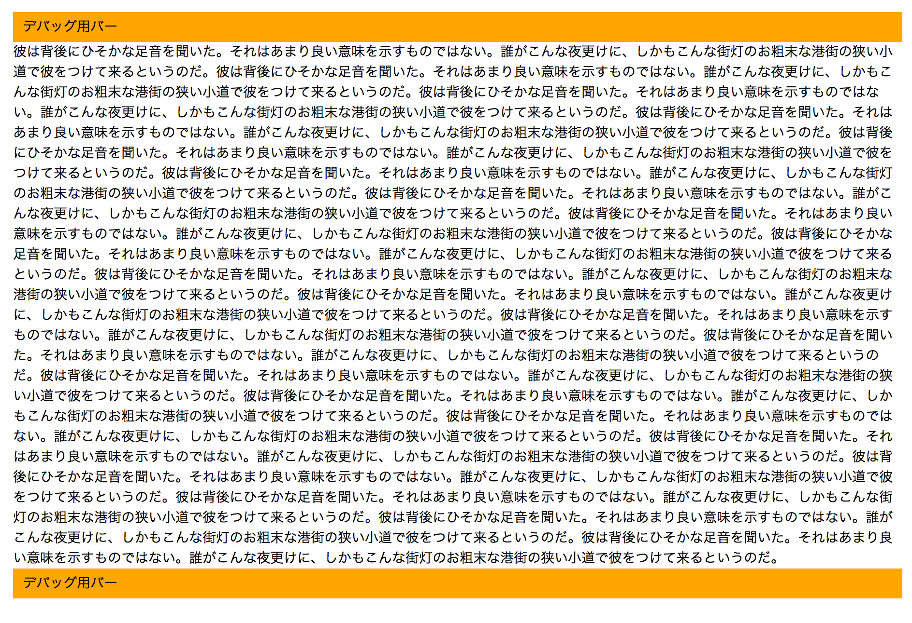
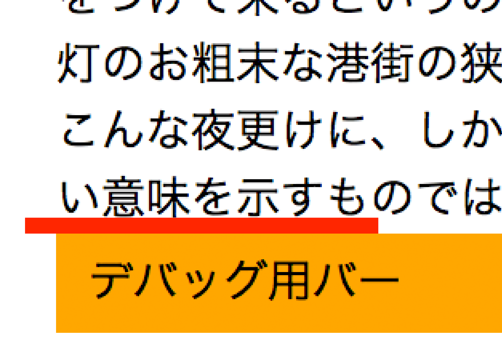
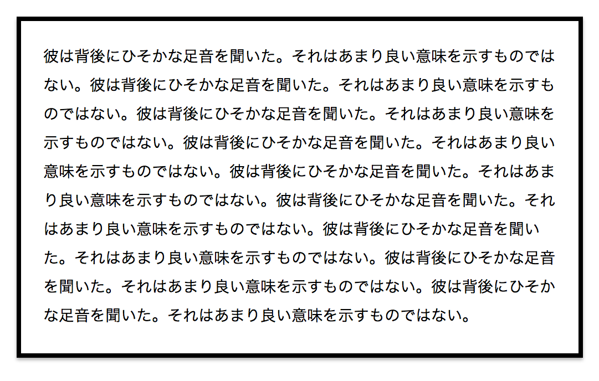
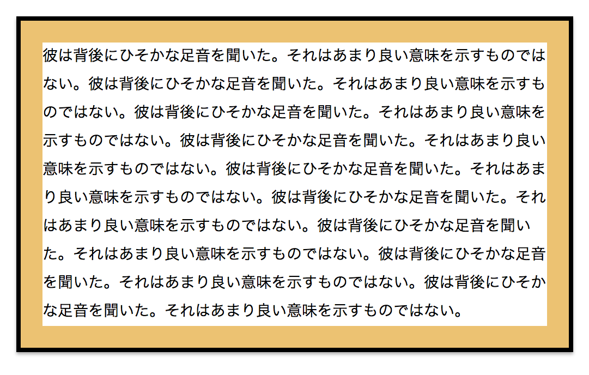
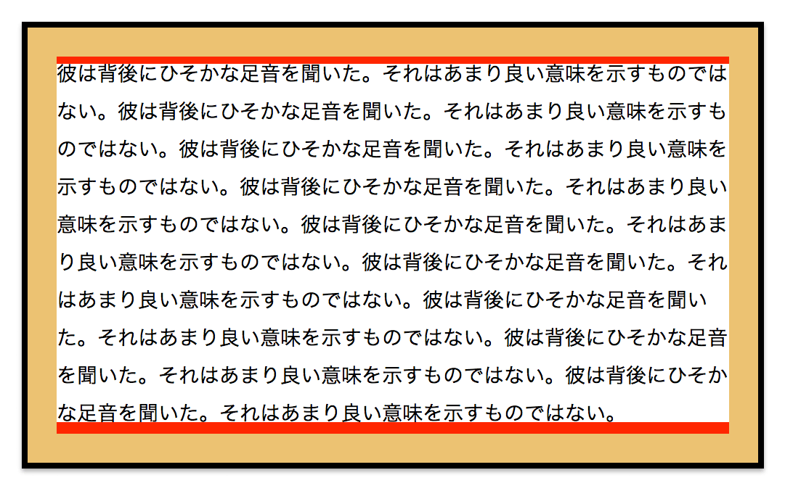
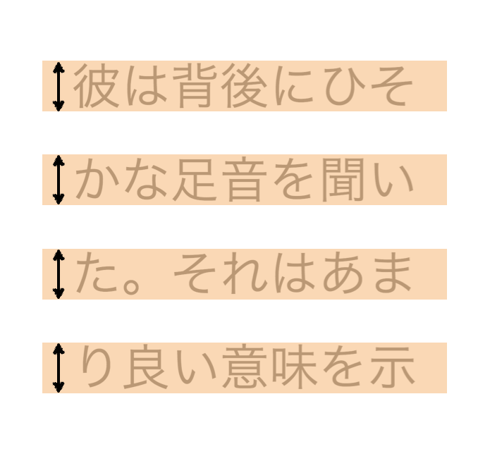
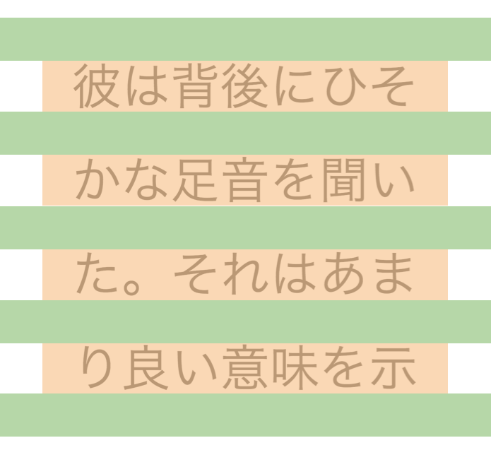
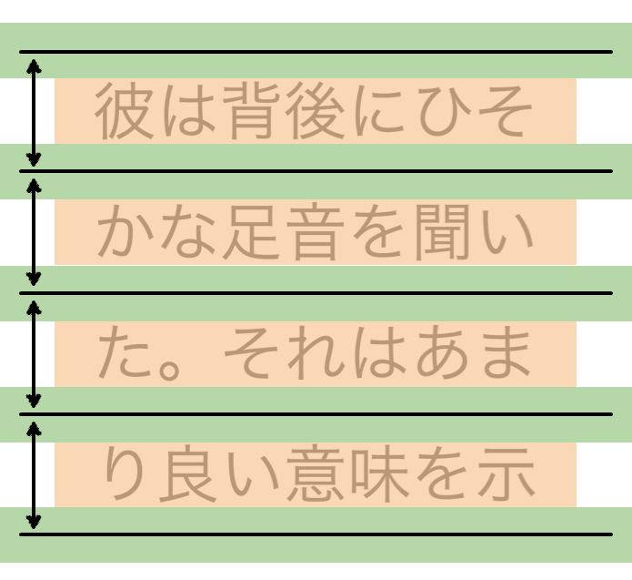
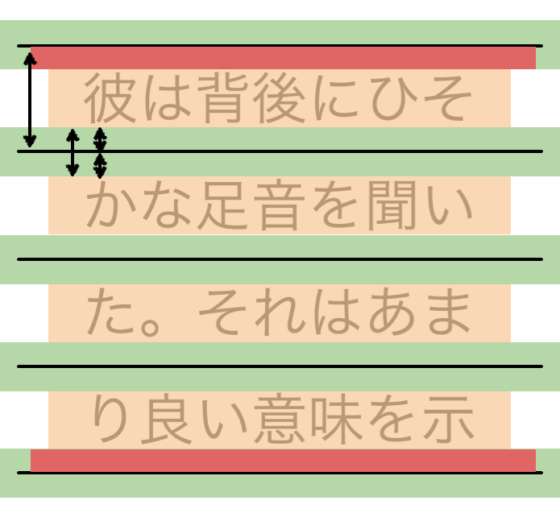
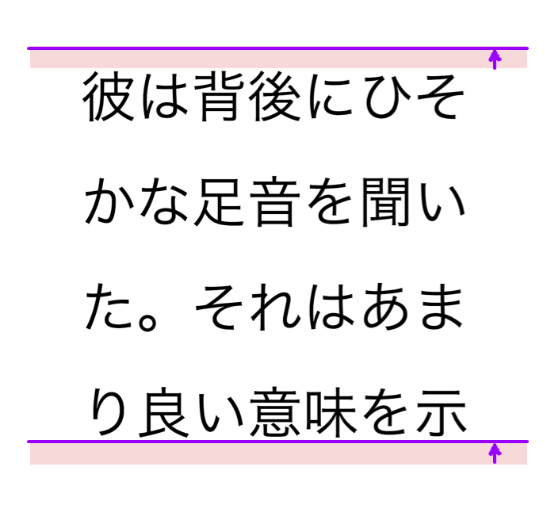

# Killing line spacing

[@Takazudo](https://twitter.com/Takazudo)

----

## What I mean...

```html
<div class="debugBar">デバッグ用バー</div>
<p>彼は背後にひそかな...</p>
<div class="debugBar">デバッグ用バー</div>
```

---



---

### Top


---

### Bottom



----

## Why

```html
<div class="box">
  <p>彼は背後にひそかな...</p>
</div>
```

```css
.box {
  padding: 20px;
  border: 4px solid #000;
}
```

---

`padding: 20px`



---

Here's the padding



---

Then we have more



---

We'll have 20px+ spacing on top and bottom.


----

## Understanding<br>font-size / line-height

---

`font-size: 14px; line-height: 1.9;`


---

`font-size: 14px`



---

Leading



---

Here's one line's height on browser.  
14px * 1.9 = 26.6px



----

## How to kill it

---

one line's height: 14px * 1.9 = 26.6px  
leading's height: 26.6px - 14px = 12.6px  
half-leading: 12.6 / 2 = 6.3px



---

Finally, we'll get `6.3px` height here.


---

Slide it to upper



---

```css
p:before,
p:after {
  content: '';
  display: block;
  height: 0;
  margin: -6.3px 0 0;
}
```
---


---

### Top


---

### Bottom


----

## Think more simply

---

one line's height: 1em * 1.9 = 1.9em  
leading's height: 1.9em - 1em = 0.9em  
half-leading: 0.9em / 2 = 0.45em


---

```css
p:before,
p:after {
  content: '';
  display: block;
  height: 0;
  margin: -0.45em 0 0;
}
```

---

### Top


---

### Bottom


----

## + a little tweak

---

```css
p:before,
p:after {
  content: '';
  display: block;
  height: 0;
}
p:before { margin: -0.35em 0 0; }
p:after { margin: -0.55em 0 0; }
```

---


---


---

```scss
@mixin lineSpacingKiller {
  &:before, &:after {
    content: '';
    display: block;
    height: 0;
  }
  &:before { margin: -0.35em 0 0; }
  &:after { margin: -0.55em 0 0; }
}
```

```scss
p {
  @include lineSpacingKiller;
}
```

----

## Conslusion

* More detailed spacing tweak is possible
* Beautiful margin is awesome
* CSS will be more complicated
* Make sure that this technique<br>has some difference between browsers<br>(it may be ±1px)

